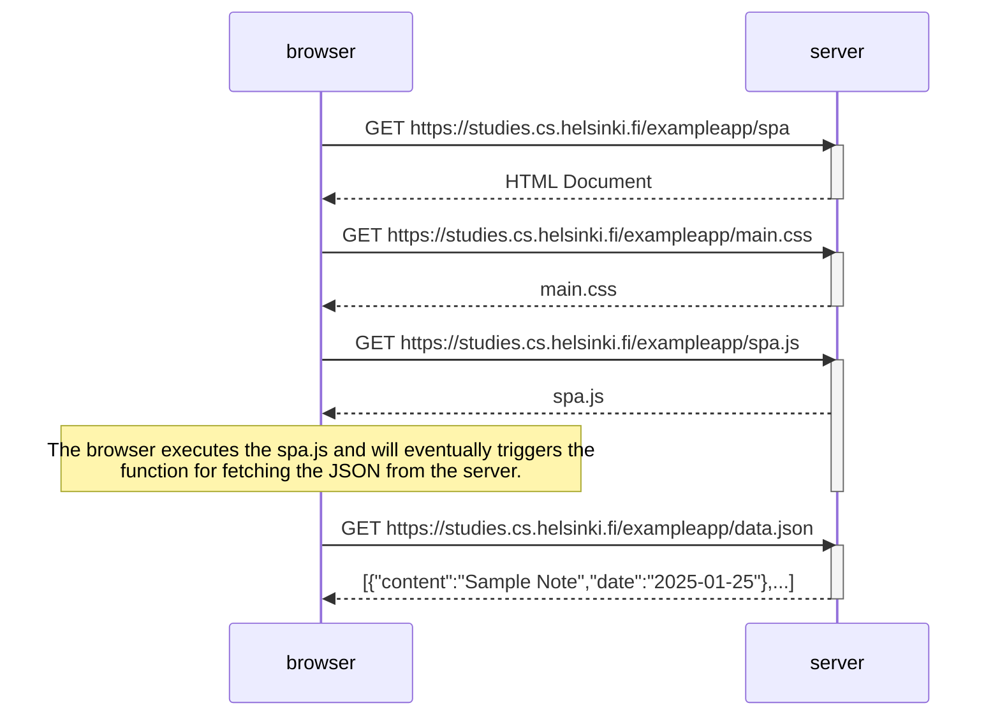

# Part0 - 0.5 Exercise

```mermaid
sequenceDiagram
    participant browser
    participant server

    browser->>server: GET https://studies.cs.helsinki.fi/exampleapp/spa
    activate server
    server-->>browser: HTML Document
    deactivate server
    %% browser will start rendering the html document. Since there is a
    %% link tag for the CSS file, the browser will request for the css file.    
    browser->>server: GET https://studies.cs.helsinki.fi/exampleapp/main.css
    activate server
    server-->>browser: main.css
    deactivate server
    %% browser will start rendering the html document with the css file.
    %% Since there is a link tag for the JavaScript file, the browser will request for the js file.
    browser->>server: GET https://studies.cs.helsinki.fi/exampleapp/spa.js
    activate server
    server-->>browser: spa.js
    Note over browser: The browser executes the spa.js and will eventually triggers the<br/> function for fetching the JSON from the server.
    deactivate server
    browser->>server: GET https://studies.cs.helsinki.fi/exampleapp/data.json
    activate server
    server-->>browser: [{"content":"Sample Note","date":"2025-01-25"},...]
    %% redrawNotes function will be triggered
    %% all returned notes by the server will be rendered in the browser
    deactivate server
```
