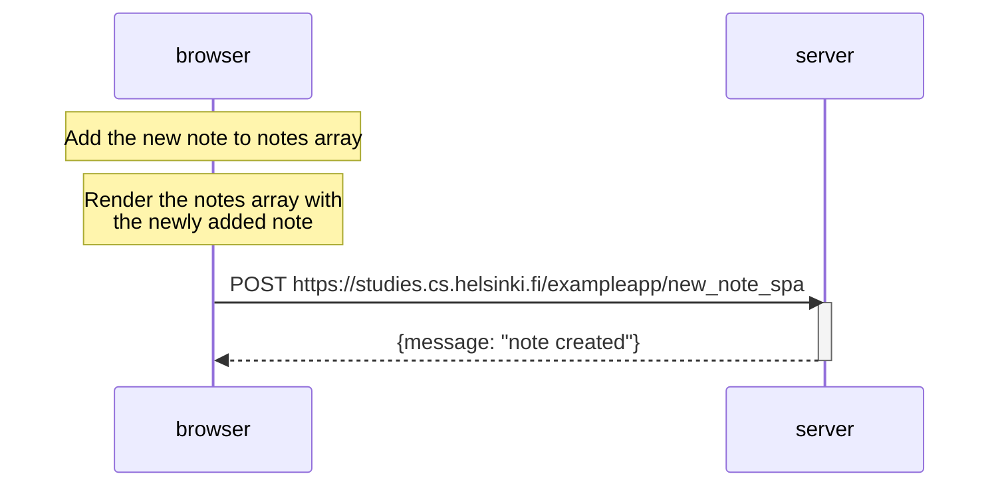

# Part0 - 0.6 Exercise

```mermaid
sequenceDiagram
    participant browser
    participant server

    Note over browser: Add the new note to notes array
    Note over browser: Render the notes array with<br>the newly added note
    browser->>server: POST https://studies.cs.helsinki.fi/exampleapp/new_note_spa
    activate server
    server-->>browser: {message: "note created"}
    deactivate server
    %% browser will start rendering the html document. Since there is a
    %% link tag for the CSS file, the browser will request for the css file.
```
